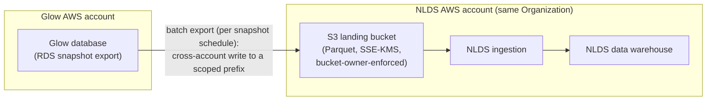

# Connect Glow to the NLDS warehouse through an S3 data-lake intermediary

## Context and Problem Statement

The NLDS Product Ops team wants Glow's learning data centralized in the NLDS
data warehouse for analytics and reporting. Glow has no automated pipeline to
NLDS today, so the data is moved by hand or not at all. This decision evaluates
candidate connector patterns and names a single recommended approach; connector
implementation, warehouse schema/table mapping, and historical backfill are
explicitly out of scope
(see [issue #597](https://github.com/String-sg/onward/issues/597)).

There is **no hard requirement to curate** what is sent. Glow's learning data is
not sensitive in nature, and NLDS will decide how it wants to use the data, so
the connector exports the **whole database** rather than a filtered subset.
Curating the export to specific datasets could be re-explored in the future, but
nothing about the current use case requires it.

Two facts about the environment shape the decision. First, the reporting and
analytics use case tolerates **batch freshness** — daily data is acceptable;
there is no near-real-time requirement. Second, Glow and NLDS run in **separate
AWS accounts within the same AWS Organization**, so cross-account mechanisms are
available but the two networks are not one VPC. No external policy mandates or
forbids a particular network posture, so the options are judged on their merits.

## Decision Drivers

- **Cost** — both one-time build and ongoing operational spend.
- **Security posture** — network exposure, account/network boundaries, and how
  much of Glow's data surface is reachable by NLDS.
- **Data freshness and latency** — batch is sufficient; near-real-time is not
  required.
- **Implementation and operational effort** — setup work plus the standing
  burden of credentials, replicas, and network plumbing.
- **Coupling** — keeping Glow's operational system and the NLDS warehouse able to
  evolve independently.

## Considered Options

- **S3 data-lake intermediary** — Glow exports a whole-database snapshot to an S3
  bucket; NLDS ingests from there on its own schedule.
- **Database replica exposed via AWS PrivateLink** — NLDS connects to a read
  replica of Glow's database over a one-directional, account-to-account private
  endpoint.
- **Database replica reachable via VPC Peering** — NLDS connects to a read
  replica of Glow's database over a peered network path between the two VPCs.
- **AWS Database Migration Service (DMS)** — a managed DMS task reads from Glow's
  database and lands data either in S3 or directly in the warehouse, in full-load
  or change-data-capture mode.
- **RDS snapshot export to S3** — Glow's managed database exports automated
  snapshots to S3 as Parquet, with no application export code, which NLDS then
  ingests.

The originating spike named the first three options. The latter two were added
during evaluation because a reviewer would reasonably expect the AWS-native
database-to-warehouse mechanisms to be addressed.

## Decision Outcome

Chosen option: **S3 data-lake intermediary**, with an **RDS snapshot export** as
the producer, because it is the only option whose freshness profile matches the
batch requirement while also being the cheapest, the least network-exposed, and
the lowest-effort to stand up and operate. The snapshot export lands the whole
database in S3 as Parquet with no export code to write, and NLDS ingests from
there on its own schedule. Glow already runs an S3 integration in the same
region, so this reuses existing infrastructure rather than introducing a database
replica, a network path, or a private endpoint.

Both database-replica options provide near-real-time freshness that the use case
does not ask for, and they pay for it with a materially larger blast radius (a
live replica of the operational database is reachable by another account) and a
heavier standing operational burden (replica provisioning, credential rotation,
and either an endpoint service or a peered network to maintain). With batch
freshness accepted, that trade buys nothing.

The two AWS-native database mechanisms relate to the choice differently. DMS also
reads from the source database — so it carries the same operational-database
exposure as the replica options, and runs a replication instance continuously —
and is better understood here as a possible loader _into_ the S3 lake than as a
rival to it. RDS snapshot export, by contrast, is **the chosen producer** for the
S3 intermediary: it is the lowest-effort producer of all, it reads an automated
snapshot rather than the live instance, and it writes analytics-friendly Parquet
with no export code. Its usual drawback — that it exports the entire database
rather than curated subsets — does not apply here, because there is no
requirement to curate what is sent.

The S3 intermediary also keeps the two systems decoupled: Glow produces the
export, NLDS ingests on its own cadence, and neither side gains reachability into
the other's network or live schema. The only cross-account grant is on the write
path: a scoped bucket policy lets Glow's export identity assume a least-privilege
role to write to its prefix — NLDS reads within its own account and needs no
cross-account role. Objects are encrypted at rest with KMS, and exposure can be
narrowed further to specific bucket prefixes.

The mechanism is content-agnostic: the same export path carries a whole-database
dump and curated slices equally well. The whole database is exported here because
Glow's data is not sensitive and NLDS has no need for a filtered subset. Should
curation ever become desirable, it would be a change of producer and content
within this same S3 pattern — swapping the snapshot export for a purpose-built
export job — not a new architecture, since no network path, replica, or endpoint
is introduced either way.

### Bucket ownership

The intermediary bucket lives in the **NLDS account**, not the Glow account.
The deciding axis is governance ownership rather than anything technical — both
placements are fully supported by cross-account S3 — and because NLDS owns the
warehouse, the raw landing zone naturally belongs with the lake. That keeps
retention, lifecycle, the encryption key, and any cataloging of ingested data in
a single account, and it matches the standard multi-account data-lake pattern
where producers push into a central raw bucket. Glow's footprint shrinks to
producing the export and pushing it; it does not operate a long-lived bucket.
NLDS reads natively within its own account, with no cross-account role on the
ingestion path.

Glow is granted scoped write permission to a dedicated prefix in that bucket.
The bucket is configured with S3 Object Ownership set to bucket-owner-enforced,
which disables ACLs so NLDS owns every object regardless of which account wrote
it — this sidesteps the classic cross-account trap where objects written by one
account remain unreadable by the bucket owner.

The alternative — a Glow-owned bucket with NLDS granted scoped read — is
reasonable only if Glow retaining tight, account-local control over egress
outranks centralizing the lake in NLDS; it was not chosen here because the goal
is to centralize learning data in the NLDS warehouse.

### Consequences

- Good, because it is the cheapest option — S3 storage plus a periodic snapshot
  export, with no standing endpoint or replica running cost.
- Good, because there is no network path between the two accounts, and the
  producer reads a database snapshot rather than the live operational instance —
  so the live database is never reachable by NLDS.
- Good, because it is the lowest build effort of all — a configured RDS snapshot
  export plus a bucket policy, with no export code to write, rather than new
  database or network infrastructure.
- Good, because siting the bucket in the NLDS account keeps retention, lifecycle,
  the encryption key, and cataloging of the centralized data under the warehouse
  owner, while Glow operates no long-lived bucket.
- Good, because the two systems stay decoupled and can evolve their schemas and
  schedules independently.
- Bad, because freshness is limited to the snapshot/export cadence; if NLDS later
  needs near-real-time data, this pattern will not satisfy it and the PrivateLink
  option becomes the documented upgrade path.
- Neutral, because the whole database is exported, placing Glow's full operational
  schema (as Parquet) in the NLDS account; this is acceptable because the data is
  not sensitive, and curating the export could narrow it if that ever changes.
- Bad, because the export step is a producer responsibility Glow must own and
  monitor (snapshot-export configuration and success).
- Neutral, because warehouse schema and table mapping are out of scope and will
  be decided separately.
- Neutral, because the connector exports the whole database; curating what is
  sent can be re-explored later if the need arises.

### Confirmation

This ADR is confirmed when the NLDS Product Ops representative and the Glow
engineering representative both accept the recommendation and the status moves to
`accepted`. Realization of the connector is a separate, follow-on effort; its
design will reference this ADR for the chosen direction and rejected
alternatives.

## Pros and Cons of the Options

### S3 data-lake intermediary

Glow writes a whole-database RDS snapshot export cross-account to an S3 bucket in
the NLDS account; NLDS reads it from its own account on its own schedule.

- Good, because cost is lowest — storage plus a periodic export, no standing
  endpoint or replica charges.
- Good, because there is no network path between accounts; the only cross-account
  grant is a scoped bucket policy letting Glow's export identity write to its
  prefix, while NLDS reads within its own account with no cross-account role.
- Good, because the producer reads a snapshot rather than exposing the live
  operational schema, keeping the network blast radius small.
- Good, because it reuses Glow's existing S3 integration, minimizing build effort
  — the snapshot export needs no export code at all.
- Good, because producer and consumer stay decoupled and independently
  evolvable.
- Bad, because freshness is bounded by the export cadence (batch only).
- Bad, because Glow takes on an export to run and monitor.

### Database replica exposed via AWS PrivateLink

NLDS connects to a read replica of Glow's database through a one-directional,
account-to-account private endpoint.

- Good, because it provides near-real-time freshness.
- Good, because the private endpoint is one-directional and scoped to a single
  service, avoiding broad network-level reachability.
- Good, because it needs no CIDR coordination between the two accounts.
- Bad, because it exposes a live replica of the operational database to another
  account — a larger, live surface than a static S3 export of the same data.
- Bad, because ongoing cost is higher — private endpoint hours, a load balancer,
  and per-GB processing.
- Bad, because operational burden is heavier — replica provisioning, an endpoint
  service, a consumer endpoint, and database credential rotation.
- Bad, because the near-real-time freshness it buys is not required by the use
  case.
- Neutral, because it is the natural upgrade path should near-real-time become a
  genuine requirement later.

### Database replica reachable via VPC Peering

NLDS connects to a read replica of Glow's database over a peered network path
between the two VPCs.

- Good, because it provides near-real-time freshness.
- Good, because in-region peering carries no per-hour peering fee.
- Bad, because it has the broadest network exposure — route-level reachability
  between the two VPCs rather than a single scoped service.
- Bad, because it requires non-overlapping CIDR coordination with the NLDS
  account and couples both accounts' network lifecycles.
- Bad, because it still exposes a replica of the operational database.
- Bad, because it offers no freshness advantage over PrivateLink while carrying a
  worse security posture, making it strictly less attractive than that option.

### AWS Database Migration Service (DMS)

A managed DMS task reads from Glow's database and writes to S3 or the warehouse,
in full-load (batch) or change-data-capture mode.

- Good, because it provides batch or near-real-time freshness from one managed
  service, with no hand-written export loop.
- Good, because in CDC mode it can keep the warehouse continuously current if
  that need ever emerges.
- Neutral, because it can target the chosen S3 lake rather than the warehouse
  directly, so it is as much a possible producer for that approach as a rival to
  it.
- Bad, because it reads from the source database, reintroducing the
  operational-database exposure and a replication endpoint that the S3 approach
  avoids.
- Bad, because ongoing cost is higher — a replication instance runs continuously,
  plus per-GB processing.
- Bad, because it adds a managed service with its own task, schema-mapping, and
  monitoring burden for freshness the use case does not require.

### RDS snapshot export to S3

Glow's managed database exports automated snapshots to S3 as Parquet with no
application export code; NLDS ingests from there. This is the **selected producer
for the S3 intermediary** (see Decision Outcome), not a rejected alternative — it
is listed here for completeness against the other mechanisms.

- Good, because it is the lowest build effort — a configured export, no export
  job to write or maintain.
- Good, because it lands analytics-friendly Parquet in S3 and reuses the
  cross-account S3 access path the chosen approach already establishes.
- Good, because it reads an automated snapshot rather than the live instance, so
  it needs no replication endpoint and never exposes the live operational
  database.
- Neutral, because ongoing cost scales with the full database — per-GB snapshot
  export charges plus storage of a whole-database Parquet copy each run;
  acceptable given there is no requirement to reduce what is sent.
- Neutral, because it exports the entire database rather than curated datasets —
  the intended behaviour, since Glow's data is not sensitive and NLDS has no need
  for a filtered subset.
- Neutral, because freshness is tied to the snapshot schedule, but that is
  sufficient for the daily batch use case.

## More Information

No hard blockers were identified. Glow and NLDS sharing an AWS Organization makes
cross-account S3 access a well-supported, low-friction path.

Three further patterns were considered and deliberately set aside rather than
evaluated in full. **Query-in-place / federated query** (for example Athena or
Redshift Spectrum over Glow's data, or a federated query into Glow's database)
avoids copying data but couples query load and availability across the two
systems over a live path, fighting the same boundary concerns as the replica
options. **Event-streaming change data capture** (via a streaming bus such as
Kinesis, Kafka, or EventBridge) is well-decoupled and near-real-time but is
clearly over-engineered for a batch reporting need. An **application-level
extract API** that NLDS pulls from gives Glow precise control over what leaves
its boundary, but it is the most custom code to build and maintain and reinvents
the pagination, retry, and throughput handling that S3 provides for free. None
of these changes the outcome, so each is noted here rather than carried as a full
option.

This decision should be revisited if NLDS develops a genuine near-real-time
requirement, in which case the PrivateLink replica is the recommended next step
(with DMS in change-data-capture mode as the likely loading mechanism) and would
be captured in a superseding ADR. Curating the export to specific datasets —
rather than sending the whole database — could be re-explored in the future if
the need arises; because it would swap the snapshot export for a purpose-built
export job while keeping the S3 architecture, it would stay within this decision
rather than supersede it. That possibility, along with warehouse schema and table
mapping and historical backfill, is out of scope here and will be decided
separately, referencing this ADR for the connector direction.
