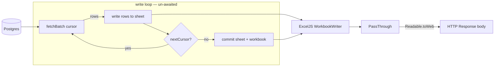

# Streaming Report Exports (ExcelJS) — Design

**Status:** Draft
**Issue:** none
**Depends on / Related:** foundation for [Onboarding Report](./2026-06-08-onboarding-report-design.md) (Spec B). This is Spec A; Spec B builds on the helper defined here.

## Overview

The admin quiz export (`admin/api/download`) loads every matching row into memory, builds the whole workbook, and serializes it to a single buffer before sending, so memory scales linearly with row count. As data grows, a single export can spike memory and destabilize the server. There is also no reusable export path, so the upcoming onboarding report would otherwise copy the same buffered pattern. This spec replaces that with a memory-bounded, end-to-end streaming export built on ExcelJS: rows are read from the database in cursor-batched pages straight into an ExcelJS `WorkbookWriter`, whose output is piped to the HTTP response, so neither the full result set nor the full file is ever held in memory. The streaming logic lives in one reusable helper, fixing the memory model once ahead of the onboarding report (Spec B) adding a second export.

Scope: the **existing quiz export only**. The onboarding report (Spec B) reuses the helper introduced here; no UI/pagination changes to the reports page and no change to the report's columns or filename format (output is equivalent to today, minus row ordering — see Architecture).

The deploy adapter is `@sveltejs/adapter-node` on Node 24, so streaming `Response` bodies (via `Readable.toWeb`) are supported. `xlsx` (SheetJS) is currently imported in exactly one place — `src/routes/admin/api/download/+server.ts` — and vendored as a local tarball (`file:vendor/xlsx-0.20.3.tgz`), so migrating the quiz export removes that dependency entirely; `exceljs` is not yet a dependency and is added by this work.

## Goals

- **Goal:** bounded memory regardless of dataset size — true streaming of both the DB read and the file write.
- **Goal:** a reusable export helper so additional reports plug in without re-implementing streaming.

## Architecture

> Decision: stream end-to-end with ExcelJS through a generic `generateReport` helper. See [ADR-0001](../../decisions/0001-stream-report-exports-with-exceljs.md).
> Decision: read each batch with keyset cursor pagination on the primary key. See [ADR-0002](../../decisions/0002-keyset-cursor-pagination-on-primary-key.md).

`ExcelJS.stream.xlsx.WorkbookWriter` writes to a Node `stream.PassThrough`. The readable side is converted with `Readable.toWeb(passThrough)` and returned as the SvelteKit `Response` body. The write loop runs **un-awaited** so the response starts streaming immediately while rows are still being fetched and written; because it is not awaited, the loop carries its own `.catch` (see Error handling). Each iteration pulls one cursor-batched page (ordered by primary key — quiz: `LearningJourney.id`) via `fetchBatch`, writes its rows, and continues until `nextCursor` is undefined, then commits the worksheet and workbook.

Because the export is ordered by primary key rather than `user.name` (today's behavior), the on-disk row order differs from before; the admin can sort any column in Excel. Per-cell sanitization (`sanitizeSpreadsheetCell`) is applied to every string cell as it is written.



## Contracts & boundaries

### `generateReport`

- **Does:** turns a column definition + a cursor-driven batch fetcher into a downloadable `.xlsx` HTTP response. Delivery is streamed end-to-end (a guarantee below), but the name stays intent-level — callers never depend on the mechanism.
- **Use:** declaration-level signature below; the caller passes columns, a `fetchBatch` closure over its Prisma query, and an optional `onError` callback.
- **Depends on:** `exceljs` and the caller-supplied `fetchBatch`; `onError` is optional. It takes no `RequestEvent` and has no logging dependency — error observation is inverted to the caller via `onError`, so the helper stays fully decoupled from SvelteKit, from any logger, and from app/business logic. A caller that does not care to observe failures simply omits `onError`.
- **Guarantees:** bounded memory (streams read + write); sets response headers including `Cache-Control: no-store`; sanitizes every string cell; commits the workbook when the cursor is exhausted; on a mid-stream error, **always destroys the stream** (the client sees a broken/incomplete download), and invokes `onError` if one was provided.
- **Requires:** `fetchBatch` returns `{ rows, nextCursor }` and yields `nextCursor: undefined` exactly when the data is exhausted. `onError` is optional; when omitted, a mid-stream failure still destroys the stream but is not surfaced to the caller (unobserved by design — observation is the caller's choice, never the helper's). The helper never throws on a fetch failure, so omitting `onError` cannot produce an unhandled rejection.

```ts
interface Column<Row> {
  header: string;
  value: (row: Row) => string | number | boolean;
}

interface GenerateReportOptions<Row, Cursor> {
  filename: string;
  sheetName: string;
  columns: Column<Row>[];
  fetchBatch: (cursor: Cursor | undefined) => Promise<{ rows: Row[]; nextCursor: Cursor | undefined }>;
  onError?: (err: unknown) => void;
}

generateReport<Row, Cursor>(options: GenerateReportOptions<Row, Cursor>): Response;
```

### `sanitizeSpreadsheetCell`

- **Does:** neutralizes CSV/formula injection in a single string cell.
- **Use:** `sanitizeSpreadsheetCell(value: string): string`.
- **Depends on:** nothing.
- **Guarantees:** prefixes a leading `=`, `+`, `-`, `@`, tab, or CR with `'`; leaves safe values unchanged.
- **Requires:** a string input.

### `formatTimestamp`

- **Does:** formats a `Date` as a `DDMMYYYYHHmmss` string for report filename prefixes.
- **Use:** `formatTimestamp(date: Date): string`.
- **Depends on:** nothing.
- **Guarantees:** returns 14 digits — day, month, year, hours, minutes, seconds, each zero-padded, in local time. Carries no business meaning and no filename suffix; each caller assembles its own filename around the prefix.
- **Requires:** a `Date`.

Shared by both exports (this report and the onboarding report, Spec B); co-located with `sanitizeSpreadsheetCell` in `reports/helpers.ts`. The per-report filename suffix (e.g. `_user_report.xlsx`) stays in each endpoint.

Information-hiding test: an endpoint declares only its columns, `fetchBatch`, and (optionally) `onError`; the streaming loop, PassThrough bridge, headers, commit, and stream-destroy-on-error are all internal to the helper and can change without touching consumers. The helper always owns the recovery (destroying the stream); it notifies the caller through `onError` only when one is provided, so logging stays out of the helper.

## Components / changes

### 1. Add `exceljs`, remove vendored `xlsx`

Add `exceljs` to dependencies; remove the `xlsx` entry and the `vendor/xlsx-0.20.3.tgz` tarball once the quiz endpoint no longer imports it.

### 2. `src/lib/server/reports/` (new)

A new feature folder following the repo's `src/lib/server/{auth,chat,unit,cache}` convention — responsibility-named source files, a barrel `index.ts` that re-exports them (`export * from './x.js'`), co-located `*.test.ts`, and consumers importing the folder (`$lib/server/reports`). It holds:

- `generateReport.ts` — the generic streaming helper.
- `helpers.ts` — the shared pure `sanitizeSpreadsheetCell` and `formatTimestamp` utilities defined under Contracts & boundaries (both referenced by Spec B).
- `index.ts` — barrel re-exporting both.

### 3. `src/routes/admin/api/download/quiz/+server.ts` (moved + modified)

Moved from `admin/api/download/+server.ts` (sole `xlsx` consumer). Rewritten to use `generateReport`. **Business logic / scope is preserved**: the download still returns all rows for the selected quiz (same `where` filter, same columns, same filename), independent of the table's UI pagination. The only behavioral deltas are internal (streaming), row order (name → primary key), and the security hardening below.

- Auth check (401 if no `user`) — defense-in-depth atop the `/admin` hook guard.
- Not-found check: when a `quizId` is supplied but the lookup returns no quiz, respond 404 before streaming — a bad id is an error, not an empty report.
- `columns`: Name, Email, Quiz Title, Is Completed (`Yes`/`No`), Number of Attempts — same as today.
- `fetchBatch`: Prisma cursor on `LearningJourney.id`, preserving the existing `where` (`questionAnswers: { some: {} }`, optional `quizId`), selecting `user { name, email }`, `learningUnit { title }`, `isCompleted`, `numberOfAttempts`.
- `onError`: logs the failure through the endpoint's handler logger (`event.locals.logger`). The helper itself stays logger-agnostic.
- Filename `DDMMYYYYHHmmss_{quizTitle}_user_report.xlsx`, sheet `"Quiz Report"`. The `DDMMYYYYHHmmss` prefix comes from the shared `formatTimestamp`; the endpoint assembles the rest. `quizTitle` comes from a one-off `db.learningUnit.findUnique` (when `quizId` is set), run in the endpoint **before** calling `generateReport` and passed in as `filename` — the `fetchBatch` contract covers row batches only, not this header lookup.
- Update the download link in `src/routes/admin/(protected)/reports/+page.svelte` to `/admin/api/download/quiz?quizId=...`.

## Error handling

- **Before streaming:** unauthenticated request → 401; a supplied `quizId` that resolves to no quiz → 404 (the endpoint does not conflate "not found" with "empty result"); the `quizTitle` lookup runs before `generateReport`, so a lookup failure is a clean 500 and a missing quiz a clean 404 — both before any bytes are sent.
- **Frontend on error:** the download stays a native anchor navigation (`data-sveltekit-reload`), deliberately not a `fetch`, so the browser streams the response straight to disk with near-zero client memory — the point of the feature. The trade-off is that a non-200 (401/404/500) is a full navigation showing the raw body rather than an in-page error. This is acceptable because the quiz dropdown only offers valid ids, so the 404 path is near-unreachable from the UI (it covers deleted/stale ids and direct URL access). Graceful in-page error UX would require buffering the file in browser memory (blob) or the File System Access API, and is intentionally out of scope.
- **Mid-stream (after headers sent):** the status and headers are already committed, so an error during the fetch/write loop cannot become a clean 500. The un-awaited write loop's `.catch` always destroys the `PassThrough` (the browser sees a failed/incomplete download and the admin retries) and, if the caller supplied `onError`, invokes it — the quiz endpoint supplies one that logs server-side through its handler logger. A buffer-then-send fallback was rejected (see [ADR-0001](../../decisions/0001-stream-report-exports-with-exceljs.md)) because it reintroduces the memory cost being removed.

## Security considerations

- **CSV / formula injection (OWASP A03).** `user.name` is end-user-controlled; `sanitizeSpreadsheetCell` neutralizes formula-triggering leading characters on all string cells.
- **Information disclosure (STRIDE).** `Cache-Control: no-store` on the PII response; only required fields selected.
- **Access control (OWASP A01; STRIDE: EoP / Info Disclosure).** Unchanged — `/admin/**` is gated by `src/routes/admin/hooks.server.ts`; the per-handler 401 stays as defense-in-depth.
- **Denial of Service (STRIDE).** Addressed directly by this spec — cursor-batched reads + streamed output bound memory.
- **CSRF / Tampering.** N/A — read-only `GET`, no state mutation.

## Testing

AAA, inline setup, no shared test helpers:

- `sanitizeSpreadsheetCell`: prefixes leading `= + - @`, tab, CR; leaves safe values unchanged.
- `formatTimestamp`: returns 14 zero-padded digits (`DDMMYYYYHHmmss`) for a known `Date`.
- `generateReport`: drives `fetchBatch` until `nextCursor` is undefined; produces a readable stream; on a `fetchBatch` error, aborts the stream and calls `onError` when provided, and aborts without throwing (no unhandled rejection) when `onError` is omitted.
- Quiz endpoint: 401 when unauthenticated; 404 when a supplied `quizId` resolves to no quiz; correct columns/row mapping; cursor advances across multiple batches; honors `quizId` filter.
- Boundary conditions: empty result set yields a valid header-only workbook; with no `quizId`, the existing `where` runs without the optional filter.
