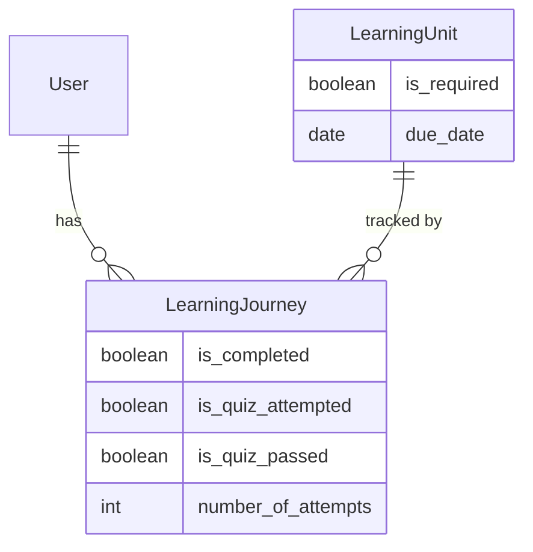
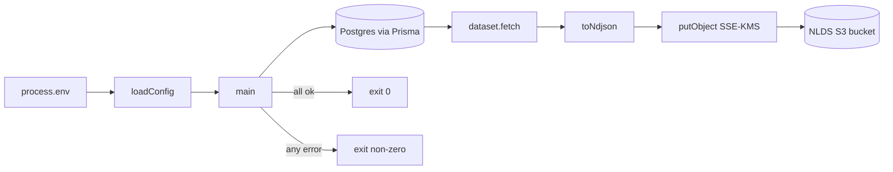

# NLDS Mandatory-Quiz-Completion Export — Design

**Status:** Draft
**Depends on / Related:** [ADR-0006](../../decisions/0006-package-nlds-export-as-bundled-script-in-app-image.md) (packaging), infra spec `export:nlds` (invocation contract)

## Overview

A daily scheduled ECS task must export curated data from the Onward database to
the NLDS-owned S3 data lake so NLDS can track **mandatory quiz completion** —
which users have (and have not) completed the mandatory learning modules. The
export is a batch script that runs to completion and exits: it connects to the
database read-only, produces one object per dataset, uploads them to the
cross-account bucket under a scoped prefix with SSE-KMS, and exits `0` on full
success or non-zero on any failure (the scheduler alerts on non-zero).

This spec covers **two datasets only**: `users` (identity dimension) and
`mandatory_quiz_outcomes` (the per-user completion fact for mandatory modules).
Each run writes a **full snapshot** (current state of all rows), not an
incremental delta, because completion tracking needs a complete point-in-time
picture of who is outstanding — a single day's file must answer that on its own.

Packaging and execution (how the script runs inside the app image with only
Prisma + the S3 client available) are decided in
[ADR-0006](../../decisions/0006-package-nlds-export-as-bundled-script-in-app-image.md);
this spec consumes that outcome. **Out of scope** (per the infra ADR): dataset
selection rationale beyond the two above, warehouse schema mapping, historical
backfill, and the NLDS-side bucket/ingestion.

## Goals

- **Auditability / completeness:** each daily run emits a complete snapshot from
  which "who has not completed which mandatory module" is answerable from one
  file.
- **Fail-loud:** any query, serialization, config, or upload error aborts the run
  with a non-zero exit and a logged cause; no partial-success masquerading as
  success.
- **Least data leaving Glow:** only the explicitly enumerated columns are
  exported — no `SELECT *`, no fields beyond those listed here.
- **No new runtime dependencies:** uses only Prisma and `@aws-sdk/client-s3`
  (per ADR-0006); the bundler is build-stage only.
- **Idempotent per day:** re-running overwrites the same day's key; never
  appends.

## Requirements

Invocation contract (fixed by infra — not changed here):

| Aspect    | Value                                        |
| --------- | -------------------------------------------- |
| Command   | `pnpm run export:nlds`                       |
| Exit code | `0` on full success; non-zero on any failure |
| Runtime   | Node, ARM64, no shell tools (SDK only)       |

Environment (injected by the task definition):

| Var               | Meaning                                                                 |
| ----------------- | ----------------------------------------------------------------------- |
| `POSTGRES_URL`    | DB connection (read-only use)                                           |
| `NLDS_BUCKET`     | target bucket name                                                      |
| `NLDS_PREFIX`     | key prefix the role is scoped to (e.g. `glow/`); never write outside it |
| `NLDS_KMS_KEY_ID` | KMS key ARN for SSE-KMS on every `PutObject`                            |
| `AWS_REGION`      | AWS region (e.g. `ap-southeast-1`)                                      |

Output objects (NDJSON — one JSON object per line, UTF-8, trailing newline):

- `${NLDS_PREFIX}users/${YYYY-MM-DD}.ndjson`
- `${NLDS_PREFIX}mandatory_quiz_outcomes/${YYYY-MM-DD}.ndjson`

`YYYY-MM-DD` is the run date in **UTC**. Keys are relative to `NLDS_PREFIX`; the
script must never construct a key outside it.

`users` record fields (identity dimension — **contains PII**):

| Field        | Source             | Type              |
| ------------ | ------------------ | ----------------- |
| `id`         | `users.id`         | string (uuid)     |
| `name`       | `users.name`       | string            |
| `email`      | `users.email`      | string            |
| `created_at` | `users.created_at` | string (ISO 8601) |

`mandatory_quiz_outcomes` record fields (completion fact):

| Field                 | Source                                 | Type                  |
| --------------------- | -------------------------------------- | --------------------- |
| `user_id`             | `learning_journeys.user_id`            | string (uuid)         |
| `learning_unit_id`    | `learning_journeys.learning_unit_id`   | string (uuid)         |
| `learning_unit_title` | `learning_units.title`                 | string                |
| `due_date`            | `learning_units.due_date`              | string (date) \| null |
| `is_completed`        | `learning_journeys.is_completed`       | boolean               |
| `is_quiz_attempted`   | `learning_journeys.is_quiz_attempted`  | boolean               |
| `is_quiz_passed`      | `learning_journeys.is_quiz_passed`     | boolean \| null       |
| `number_of_attempts`  | `learning_journeys.number_of_attempts` | number                |
| `updated_at`          | `learning_journeys.updated_at`         | string (ISO 8601)     |

## Data model

"Mandatory module" = a `LearningUnit` with `is_required = true`. The completion
outcome is the `LearningJourney` row (unique per `user_id` + `learning_unit_id`),
which already carries `is_completed`, `is_quiz_attempted`, `is_quiz_passed`, and
`number_of_attempts`. The `mandatory_quiz_outcomes` dataset is the set of
`LearningJourney` rows whose related `LearningUnit.is_required = true`, projected
to the fields above.



The `users` dataset is the full `User` table projected to the four identity
fields (no dependency on journeys), so users with zero mandatory-module journeys
are still present as a dimension.

## Architecture

A single standalone entry module orchestrates the run. It loads and validates
config from the environment, opens one Prisma client over the pg adapter (mirror
of the seed scripts, not the SvelteKit `$lib/server/db` module, which depends on
Vite-resolved aliases), then processes each dataset in turn: fetch rows via a
scoped Prisma `select`, serialize to NDJSON, and `PutObject` with SSE-KMS. It
logs per-dataset row count and object key, disconnects, and exits with a status
that reflects whether all datasets succeeded.

Datasets are values implementing a common `Dataset` contract, so adding or
changing a dataset is a local change to its `fetch` and does not touch the
orchestrator. Serialization and upload are dataset-agnostic.

Per ADR-0006, the module is bundled ahead of time in the Docker build stage into
`build/export-nlds.js` (generated Prisma client inlined; AWS SDK and Prisma
runtime packages left external, resolved from production `node_modules`).
`pnpm run export:nlds` executes that bundle with the bare Node runtime.



## Contracts & boundaries

### `ExportConfig`

- **Does:** validated, typed snapshot of the environment the run needs.
- **Use:**

```ts
interface ExportConfig {
  postgresUrl: string;
  bucket: string;
  prefix: string;
  kmsKeyId: string;
  region: string;
}
```

- **Guarantees:** every field is a non-empty string; `prefix` is used verbatim as
  a key prefix (caller passes it including any trailing `/`).

### `loadConfig`

- **Does:** reads the required env vars and builds an `ExportConfig`.
- **Use:** `loadConfig(env: NodeJS.ProcessEnv): ExportConfig;`
- **Depends on:** the environment table above.
- **Guarantees:** returns a fully-populated `ExportConfig`.
- **Requires:** throws a descriptive error naming the first missing/empty
  variable — no defaults, no partial config.

### `Dataset`

- **Does:** names one exported dataset and knows how to fetch its rows.
- **Use:**

```ts
interface Dataset<Row extends Record<string, unknown>> {
  readonly name: string;
  fetch(client: PrismaClient): Promise<Row[]>;
}
```

- **Guarantees:** `name` is the key path segment (e.g. `users`); `fetch`
  performs a read-only, explicit-column `select` (never `SELECT *`) and returns
  plain serializable rows.
- **Requires:** a connected `PrismaClient`.

### dataset values `usersDataset`, `mandatoryQuizOutcomesDataset`

- **Does:** the two concrete datasets from the Requirements tables.
- **Use:** `const datasets: ReadonlyArray<Dataset<Record<string, unknown>>>;`
- **Guarantees:** `usersDataset` projects the four identity fields;
  `mandatoryQuizOutcomesDataset` returns journeys where
  `learningUnit.is_required = true`, projected to the nine fields; dates are
  emitted as ISO-8601 strings and `null`s preserved (not coerced to empty).

### `objectKey`

- **Does:** builds the S3 key for a dataset on a date.
- **Use:** `objectKey(prefix: string, dataset: string, date: string): string;`
- **Guarantees:** returns `` `${prefix}${dataset}/${date}.ndjson` `` and nothing
  that escapes `prefix`.

### `formatDateUtc`

- **Does:** formats a timestamp as the run's date key.
- **Use:** `formatDateUtc(now: Date): string;`
- **Guarantees:** `YYYY-MM-DD` in UTC.

### `toNdjson`

- **Does:** serializes rows to NDJSON.
- **Use:** `toNdjson(rows: ReadonlyArray<Record<string, unknown>>): string;`
- **Guarantees:** one `JSON.stringify` per line, `\n`-terminated including the
  last line; empty input yields `''`.

### `putObject`

- **Does:** uploads one object with mandatory SSE-KMS.
- **Use:**
  `putObject(client: S3Client, cfg: ExportConfig, key: string, body: string): Promise<void>;`
- **Depends on:** `@aws-sdk/client-s3` `PutObjectCommand`.
- **Guarantees:** sends `Bucket = cfg.bucket`, `Key = key`, `Body = body`,
  `ContentType = 'application/x-ndjson'`, `ServerSideEncryption = 'aws:kms'`,
  `SSEKMSKeyId = cfg.kmsKeyId`. Rejects if the put fails.
- **Requires:** `key` starts with `cfg.prefix`.

### `main`

- **Does:** orchestrates the whole run.
- **Use:** `main(): Promise<void>;` (module entry; process exit code set by the
  wrapper around it).
- **Guarantees:** processes every dataset; logs `{ dataset, key, rowCount }` per
  success; disconnects the client in all paths. Resolves only if **all** datasets
  uploaded; otherwise the process exits non-zero (see Error handling).

## Components / changes

### 1. `scripts/export-nlds.ts` (new)

The entry module implementing every contract above. Instantiates its own
`PrismaClient` over `@prisma/adapter-pg` using `cfg.postgresUrl` (pattern from
`prisma/seed.ts`), and a default `new S3Client()` (task-role credentials +
`AWS_REGION` from the environment). Bottom-of-file wrapper runs `main()`, logs
the failing dataset/cause and calls `process.exit(1)` on rejection, and
`$disconnect()`s in `finally`. No `dotenv` import (env is injected in prod; local
runs use Node's `--env-file`).

### 2. `package.json` (modified)

- Add `"export:nlds": "node build/export-nlds.js"` — the fixed prod entrypoint.
- Add `"export:nlds:bundle": "esbuild scripts/export-nlds.ts --bundle --platform=node --format=esm --target=node24 --outfile=build/export-nlds.js"` — used by the Docker build and by local runs.
- Add `esbuild` to **devDependencies** (build-stage only; never shipped to the
  runtime stage — see ADR-0006).

### 3. `Dockerfile` (modified, build stage)

After `pnpm build` and before the production-dependency prune, add
`RUN pnpm export:nlds:bundle` so `build/export-nlds.js` exists. It rides the
existing `COPY --from=build … /app/build ./build` into the production stage; no
new `COPY` and no runtime-stage change.

## Error handling

- **Missing/empty env (config):** `loadConfig` throws before any DB or S3 work;
  the wrapper logs and exits non-zero.
- **DB connect / query failure:** the connect check or a `fetch` rejects; the run
  aborts, the wrapper logs the dataset and cause, and exits non-zero. Access is
  read-only (`select` only) — the source DB is never written.
- **Serialization failure:** a non-serializable value throwing in `toNdjson`
  aborts that dataset and the run.
- **Upload failure (incl. SSE-KMS/prefix denials):** a rejected `PutObject`
  (e.g. the bucket rejecting a put without SSE-KMS, or a key outside the granted
  prefix) aborts the run non-zero. Because datasets are processed in sequence and
  the first failure aborts, a run either completes all datasets or exits
  non-zero — there is no silent partial success. Objects already uploaded before
  a later failure remain (idempotent overwrite fixes them on the next run); this
  is acceptable and surfaced by the non-zero exit + alert.
- **Client cleanup:** `$disconnect()` runs in `finally` on every path.

## Security considerations

- **Access control (OWASP A01; STRIDE: EoP).** The task role is scoped by NLDS's
  bucket + key policy to `${NLDS_PREFIX}*`; the script never assumes a role and
  never builds a key outside `cfg.prefix` (`objectKey` enforces the prefix). DB
  access uses the injected read-only-intent URL and issues only `select`s.
- **Encryption / information disclosure (STRIDE: Info Disclosure).** Every
  `PutObject` sets `ServerSideEncryption: 'aws:kms'` + `SSEKMSKeyId`; the bucket
  rejects non-KMS puts, so a regression fails loudly rather than writing
  plaintext. Data in transit uses the SDK's HTTPS default.
- **PII (OWASP A01/A02).** The `users` dataset exports `name` + `email` — PII
  leaving Glow. Mitigation: the export is limited to exactly the enumerated
  identity columns (no `SELECT *`), lands only in the KMS-encrypted,
  policy-scoped NLDS prefix, and the PII scope is called out here for review. No
  credentials, tokens, or chat/message content are exported.
- **Injection (OWASP A03).** N/A for query construction — all queries go through
  Prisma's parameterized `select`; no string-built SQL. Keys are built from a
  fixed prefix + fixed dataset name + a formatted date, not user input.
- **Secrets handling.** `POSTGRES_URL` and KMS key ARN come from the environment
  (Secrets Manager / task env); none are logged. Logs contain only dataset name,
  object key, and row count.
- **Denial of Service (STRIDE).** N/A — single scheduled batch, no inbound
  surface. Row volume is bounded by table size; see Testing note on memory.

## Testing

Unit-level (pure functions, no I/O):

- `loadConfig` — returns a full config when all vars present; throws naming the
  first missing var (one case per required var, or a representative subset).
- `objectKey` — composes `${prefix}${dataset}/${date}.ndjson`; a dataset name
  never produces a key outside the prefix.
- `formatDateUtc` — a known timestamp maps to the expected UTC `YYYY-MM-DD`,
  including a time near a UTC day boundary.
- `toNdjson` — multiple rows → one `\n`-terminated JSON line each; empty array →
  `''`; a row with a `null` field preserves `null` (not `""`).

Dataset/upload behavior (Prisma + S3 client mocked):

- `mandatoryQuizOutcomesDataset.fetch` — issues a `select` filtered to
  `learningUnit.is_required = true` and projects exactly the nine fields; a
  journey on a non-required unit is excluded.
- `usersDataset.fetch` — projects exactly the four identity fields; a user with
  no journeys still appears.
- `putObject` — the `PutObjectCommand` input carries
  `ServerSideEncryption: 'aws:kms'` and `SSEKMSKeyId` from config, correct
  bucket/key, and `application/x-ndjson` content type.
- `main` — happy path uploads both datasets and resolves; a rejected `fetch` or
  `putObject` propagates so the wrapper exits non-zero; `$disconnect` is called on
  both success and failure paths.

Acceptance (per infra "Done when"): `pnpm run export:nlds` locally (dev DB +
test prefix, real or MinIO S3) produces both `.ndjson` objects and exits `0`; a
forced failure (e.g. missing `NLDS_KMS_KEY_ID`) exits non-zero.

Note (memory): a full snapshot is buffered in memory per dataset before upload.
This is acceptable at current table sizes; if `users` or journeys grow large,
switch `putObject` to a streamed multipart upload — a `putObject`-internal change
that does not affect its contract.
