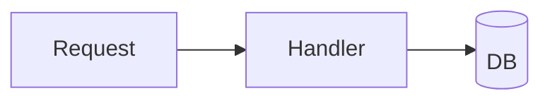

# Specs

Design specs for features and refactors, produced by the brainstorming flow
before any implementation. Start every spec from [`TEMPLATE.md`](./TEMPLATE.md).

- **Specs:** `docs/superpowers/specs/YYYY-MM-DD-<topic>-design.md`
- **Plans:** `docs/superpowers/plans/` (written after the spec is approved)
- **Decisions:** `../../decisions/` — ADRs in [MADR 4.0](https://adr.github.io/madr/) format

## What a spec is for

A spec answers **WHAT** we're building and **WHY**, and defines the **contracts
and boundaries** other work depends on. It is the contract between intent and
implementation. It does **not** contain implementation — no function bodies, no
loop internals. That belongs in the plan.

## What it must cover (from the brainstorming skill)

- **Architecture, components, data flow, error handling, testing** — the skill's
  required coverage for any design.
- **Contracts / boundaries — the unit triple.** For each new or changed unit,
  state _what it does, how you use it, and what it depends on_, plus what it
  **guarantees** and what it **requires** of callers. Apply the information-hiding
  test: can someone understand the unit without reading its internals, and can
  you change the internals without breaking consumers? If not, the boundary needs
  work. Interface **signatures** belong here; bodies do not.
- **Chosen solution only.** A spec records the decision you landed on. The
  alternatives you considered and the full rationale go in an **ADR** under
  `docs/decisions/` (MADR 4.0); the spec links to it. See the decisions
  [README](../../decisions/README.md).
- **YAGNI.** No unrequested features or speculative generality; state what's
  deliberately excluded in the overview's scope-boundary line.

## Diagrams

Use **Mermaid** fenced code blocks for all diagrams (flow, sequence, ER) so they
render in the repo and in review:

````markdown

````

## Review bar

Before handing a spec to planning it should pass the skill reviewer's bar:
**Completeness** (no TBD/placeholders), **Consistency** (no contradictions),
**Clarity** (no requirement readable two ways), **Scope** (focused enough for a
single plan), **YAGNI** (nothing unrequested).
